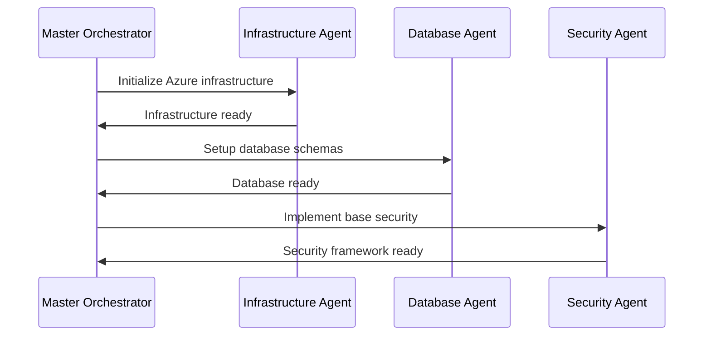
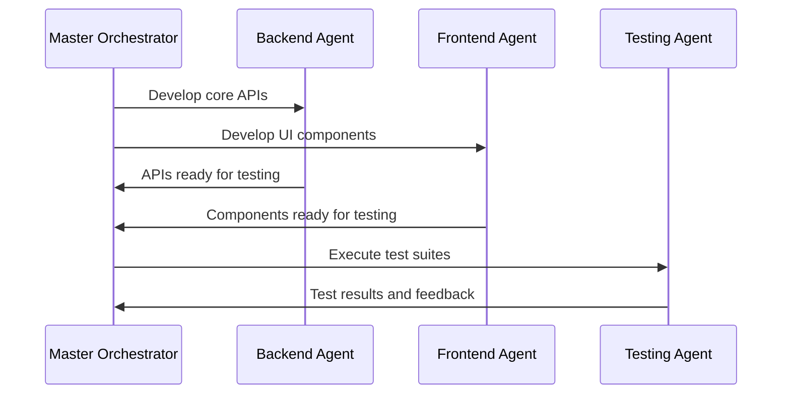
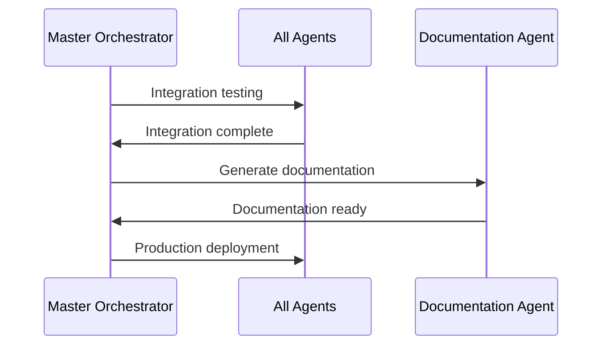

# Agent Orchestration Plan for Enterprise Work Tracking System

## Overview
This document defines the AI agent orchestration strategy for implementing the Enterprise Work Tracking System using Microsoft Agent HQ. The system will be built by coordinating multiple specialized AI agents, each responsible for specific domains of the application.

## Agent Architecture

### Master Orchestrator Agent
**Role**: Project coordination and task delegation
**Responsibilities**:
- Overall project planning and milestone tracking
- Inter-agent communication and dependency management
- Quality assurance and integration oversight
- Progress reporting and bottleneck resolution

### Infrastructure Agent
**Role**: Cloud infrastructure and DevOps setup
**Responsibilities**:
- Azure infrastructure provisioning (AKS, databases, networking)
- Terraform and Helm chart creation
- CI/CD pipeline setup (GitHub Actions, ArgoCD)
- Monitoring and logging infrastructure (Prometheus, Grafana, ELK)
- Security infrastructure (Key Vault, WAF, network policies)

### Backend API Agent
**Role**: Server-side application development
**Responsibilities**:
- Node.js/TypeScript backend services
- GraphQL and REST API implementation
- Database schema design and migrations
- Authentication and authorization systems
- Microservices architecture implementation

### Frontend Agent
**Role**: User interface development
**Responsibilities**:
- React/Next.js application development
- Component library creation (Radix UI + Tailwind)
- State management (Zustand + React Query)
- Real-time features (WebSocket integration)
- Responsive design and accessibility

### Database Agent
**Role**: Data architecture and optimization
**Responsibilities**:
- PostgreSQL schema design and optimization
- Redis caching strategies
- Elasticsearch search implementation
- Data migration scripts
- Performance tuning and indexing

### Security Agent
**Role**: Security implementation and compliance
**Responsibilities**:
- Authentication and authorization systems
- Security scanning and vulnerability assessment
- Compliance framework implementation (SOC2, GDPR)
- Security testing and penetration testing setup
- Audit logging and monitoring

### Testing Agent
**Role**: Quality assurance and testing
**Responsibilities**:
- Test strategy implementation (unit, integration, E2E)
- Test automation setup (Jest, Playwright)
- Performance testing (k6, load testing)
- Security testing integration
- Quality gates and coverage reporting

### Documentation Agent
**Role**: Technical documentation and knowledge management
**Responsibilities**:
- API documentation (OpenAPI specs)
- Architecture documentation
- User guides and tutorials
- Deployment guides
- Troubleshooting documentation

## Agent Coordination Workflow

### Phase 1: Foundation (Weeks 1-4)


### Phase 2: Core Development (Weeks 5-12)


### Phase 3: Integration (Weeks 13-16)


## Agent Communication Protocols

### Standard Message Format
```json
{
  "agentId": "string",
  "timestamp": "ISO8601",
  "messageType": "task|update|completion|error",
  "payload": {
    "taskId": "string",
    "description": "string",
    "dependencies": ["taskId1", "taskId2"],
    "deliverables": ["artifact1", "artifact2"],
    "status": "pending|in-progress|completed|blocked|failed"
  }
}
```

### Dependency Management
- **Hard Dependencies**: Must be completed before task can start
- **Soft Dependencies**: Preferred order but can run in parallel
- **Blocking Issues**: Automatic escalation to Master Orchestrator
- **Progress Tracking**: Daily status updates from all agents

## Quality Assurance Framework

### Code Quality Gates
- **Linting**: ESLint, Prettier, TypeScript strict mode
- **Testing**: 80% code coverage minimum
- **Security**: No high/critical vulnerabilities
- **Performance**: Sub-500ms API response times

### Integration Checkpoints
- **Daily Standups**: Agent status synchronization
- **Weekly Reviews**: Cross-agent integration testing
- **Milestone Gates**: Quality and completeness validation
- **Continuous Monitoring**: Real-time progress tracking

## Risk Management

### Common Risk Scenarios
1. **Agent Blocking**: Dependency bottlenecks
2. **Integration Conflicts**: Incompatible implementations
3. **Quality Issues**: Failed quality gates
4. **Resource Constraints**: Infrastructure limitations

### Mitigation Strategies
- **Redundancy**: Multiple agents for critical paths
- **Rollback Plans**: Version-controlled checkpoints
- **Escalation Procedures**: Human intervention triggers
- **Alternative Approaches**: Backup implementation strategies

## Success Metrics

### Technical Metrics
- **Delivery Time**: 16 weeks target timeline
- **Quality Score**: 95% quality gate pass rate
- **Integration Success**: < 5% rework required
- **Performance**: Meet all SLA requirements

### Agent Performance Metrics
- **Task Completion Rate**: 95% on-time delivery
- **Communication Efficiency**: < 24h response time
- **Quality Contribution**: Zero critical defects
- **Collaboration Score**: Effective cross-agent coordination

## Agent Specific Instructions

Each agent should refer to their specific instruction files:
- [Infrastructure Agent Instructions](./infrastructure-agent.md)
- [Backend API Agent Instructions](./backend-agent.md)
- [Frontend Agent Instructions](./frontend-agent.md)
- [Database Agent Instructions](./database-agent.md)
- [Security Agent Instructions](./security-agent.md)
- [Testing Agent Instructions](./testing-agent.md)
- [Documentation Agent Instructions](./documentation-agent.md)

## Getting Started

1. **Initialize Agent HQ Environment**
2. **Deploy Master Orchestrator Agent**
3. **Register All Specialized Agents**
4. **Execute Phase 1 Foundation Tasks**
5. **Monitor Progress and Adjust as Needed**

---

*This orchestration plan ensures coordinated, efficient development of the enterprise work tracking system using Microsoft Agent HQ's multi-agent capabilities.*