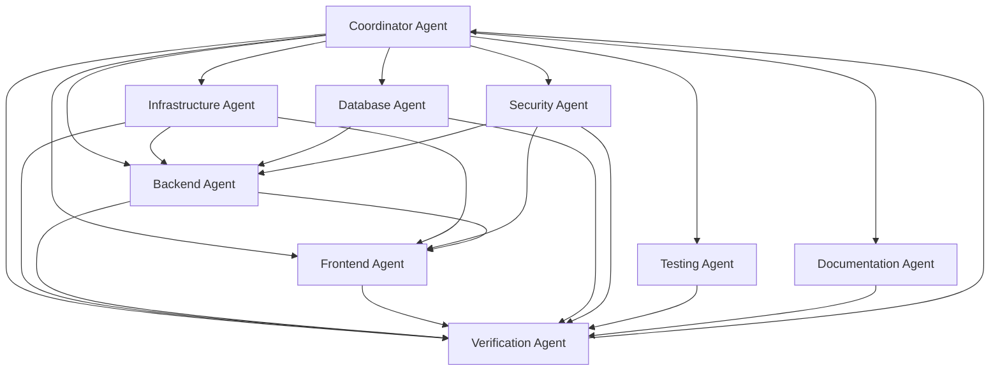

# Agent Coordination Overview

This document provides a complete set of agent instruction files for implementing the Enterprise Work Tracking System using Microsoft Agent HQ. The agent orchestration approach ensures coordinated development across all system components.

## Agent Files Created

### 1. Master Orchestration
- **`coordinator-agent.agent.md`** - Main coordination strategy and agent workflow
- Defines inter-agent communication protocols
- Establishes quality gates and success metrics
- Provides risk management and escalation procedures

### 2. Design & User Experience Specifications
- **`ui-mockups-spec.md`** - Detailed UI mockups, design system, and component specifications
- **`ux-specification.md`** - User experience flows, accessibility patterns, and interaction design
- **`cdn-specification.md`** - Comprehensive CDN architecture with accessibility optimizations

### 3. Specialized Agent Instructions
- **`verification-agent.agent.md`** - Output validation and hallucination prevention
- **`infrastructure-agent.agent.md`** - Azure cloud infrastructure and DevOps
- **`backend-agent.agent.md`** - Node.js/TypeScript API development
- **`frontend-agent.agent.md`** - React/Next.js user interface
- **`database-agent.agent.md`** - PostgreSQL database design and optimization
- **`security-agent.agent.md`** - Security framework and compliance
- **`testing-agent.agent.md`** - Comprehensive testing and quality assurance
- **`documentation-agent.agent.md`** - Technical and user documentation

### 4. Completed Agent Files

#### Verification Agent (`.github/agents/verification-agent.agent.md`)
- Output validation and accuracy checking
- Hallucination detection and prevention
- Cross-agent integration verification
- Code compilation and runtime validation
- Specification compliance checking
- Quality gate enforcement

#### Infrastructure Agent (`.github/agents/infrastructure-agent.agent.md`)
- Azure Kubernetes Service (AKS) deployment and management
- Terraform Infrastructure as Code with accessibility considerations
- GitHub Actions CI/CD with accessibility testing integration
- Monitoring and alerting with accessibility metrics

#### Backend Agent (`.github/agents/backend-agent.agent.md`)
- Node.js/TypeScript API with accessibility preference support
- GraphQL and REST endpoints for assistive technology integration
- Real-time notifications compatible with screen readers
- Accessibility metadata APIs and user preference management

#### Frontend Agent (`.github/agents/frontend-agent.agent.md`)
- React/Next.js with Microsoft accessibility standards
- WCAG 2.1 AA compliance and Section 508 support
- Windows High Contrast mode and Narrator optimization
- Keyboard navigation and screen reader compatibility

#### Database Agent (`.github/agents/database-agent.agent.md`)
- PostgreSQL schema design with accessibility metadata storage
- User accessibility preferences and assistive technology settings
- Accessibility audit trails and compliance tracking
- Performance optimization for screen reader queries

#### Security Agent (`.github/agents/security-agent.agent.md`)
- Microsoft accessibility compliance (Section 508, EN 301 549)
- Authentication with accessibility context support
- Security framework with assistive technology integration
- Incident response for accessibility security events

#### Testing Agent (`.github/agents/testing-agent.agent.md`)
- Microsoft Accessibility Insights integration
- Comprehensive accessibility testing (WCAG 2.1 AA, Section 508)
- Screen reader testing (NVDA, JAWS, Windows Narrator)
- High contrast and cognitive accessibility validation

#### Documentation Agent (`.github/agents/documentation-agent.agent.md`)
- API documentation with accessibility examples and best practices
- User guides optimized for screen readers and assistive technology
- Administrator guides for accessibility configuration and monitoring
- Compliance documentation for WCAG, Section 508, and Microsoft standards

## Implementation Package Complete

**Status: READY FOR MICROSOFT AGENT HQ DEPLOYMENT**

All 9 specialized agents (including quality control) have been created with comprehensive Microsoft accessibility integration. The complete agent orchestration package is ready for deployment with Microsoft Agent HQ.

### Complete Agent Coverage
- **Project Coordinator** (`.github/agents/coordinator-agent.agent.md`) - Complete coordination strategy
- **Verification Agent** (`.github/agents/verification-agent.agent.md`) - Output validation and hallucination prevention
- **Design Specifications** (`ui-mockups-spec.md`, `ux-specification.md`) - Detailed mockups and UX flows  
- **Infrastructure Agent** (`.github/agents/infrastructure-agent.agent.md`) - Azure cloud infrastructure and DevOps
- **Backend Agent** (`.github/agents/backend-agent.agent.md`) - Node.js API with accessibility support
- **Frontend Agent** (`.github/agents/frontend-agent.agent.md`) - React UI with Microsoft accessibility features
- **Database Agent** (`.github/agents/database-agent.agent.md`) - PostgreSQL with accessibility metadata
- **Security Agent** (`.github/agents/security-agent.agent.md`) - Security framework with accessibility compliance
- **Testing Agent** (`.github/agents/testing-agent.agent.md`) - Comprehensive accessibility testing
- **Documentation Agent** (`.github/agents/documentation-agent.agent.md`) - Accessible documentation and user guides

## Key Features of the Agent System

### 1. Coordinated Development
- **Phase-based delivery**: Foundation → Core → Integration → Polish
- **Dependency management**: Clear handoffs between agents
- **Quality gates**: Automated checks at each milestone with verification agent validation
- **Real-time collaboration**: Inter-agent communication protocols
- **Hallucination prevention**: Verification agent validates all outputs before acceptance

### 2. Enterprise-Grade Implementation
- **Scalability**: Designed for 10,000+ concurrent users
- **Security**: Zero-trust architecture with comprehensive protection
- **Performance**: Sub-500ms response times with 99.9% uptime
- **Compliance**: SOC2, GDPR, ISO27001 ready

### 3. Modern Tech Stack
- **Frontend**: React 18, Next.js 14, TypeScript, Tailwind CSS
- **Backend**: Node.js, Fastify/Express, GraphQL, Prisma
- **Infrastructure**: Kubernetes, Azure, Terraform, GitHub Actions
- **Database**: PostgreSQL, Redis, Elasticsearch

### 4. Comprehensive Testing with Microsoft Accessibility Standards
- **Test Pyramid**: 70% unit, 20% integration, 10% E2E
- **Security Testing**: SAST, DAST, dependency scanning with accessibility security
- **Performance Testing**: Load, stress, chaos engineering with assistive technology scenarios
- **Accessibility Testing**: 
  - WCAG 2.1 AA compliance
  - Section 508 compliance
  - Microsoft Accessibility Standards
  - Windows High Contrast mode support
  - Windows Narrator optimization
  - Microsoft Accessibility Insights integration

## Microsoft Agent HQ Integration

### Setup Instructions
1. **Initialize Agent HQ workspace** with the comprehensive specification
2. **Deploy Master Orchestrator** using `agents.md`
3. **Register specialized agents** with their respective instruction files
4. **Configure communication channels** between agents
5. **Establish monitoring and progress tracking**

### Agent Communication Flow

### Quality Assurance
- **Output verification**: Every agent output validated by verification agent before acceptance
- **Hallucination detection**: Automated checking for non-existent APIs, libraries, and features
- **Daily standups**: Agent status synchronization
- **Weekly integration**: Cross-agent testing and validation
- **Milestone gates**: Quality and completeness checkpoints with verification sign-off
- **Continuous monitoring**: Real-time progress and issue tracking

### Success Metrics
- **Technical**: 99.9% uptime, <500ms response times, zero critical vulnerabilities
- **Business**: 80% user adoption, >4.5/5 satisfaction, 50% productivity improvement
- **Quality**: 90% test coverage, 100% accessibility compliance, complete documentation, zero hallucinated implementations
- **Verification**: 100% of agent outputs validated, <5% rejection rate, all integrations verified

## Deployment with Microsoft Agent HQ

### Prerequisites
1. **Microsoft Agent HQ** platform access and configuration
2. **Azure Subscription** with appropriate permissions and resource quotas
3. **Development Team** familiar with accessibility standards and enterprise development
4. **Stakeholder Alignment** on accessibility requirements and compliance standards

### Deployment Process
1. **Upload Agent Package** - Load all 9 agent files from `.github/agents/` into Microsoft Agent HQ
2. **Configure Dependencies** - Set up agent coordination workflows and communication
3. **Initialize Infrastructure** - Deploy Azure resources using Infrastructure Agent
4. **Phased Deployment** - Follow master orchestration strategy (Foundation → Core → Integration → Polish)
5. **Continuous Monitoring** - Track accessibility compliance and performance throughout deployment

### Success Metrics & Compliance Targets
- **WCAG 2.1 AA Compliance**: 95% minimum across all features
- **Section 508 Compliance**: 100% for government accessibility requirements
- **Screen Reader Compatibility**: Full support for NVDA, JAWS, Windows Narrator
- **Keyboard Accessibility**: 100% of functionality accessible via keyboard
- **Performance with AT**: < 3 second page load times with assistive technology
- **User Satisfaction**: >4.5/5 from users with accessibility needs

### Next Steps
1. **Review and approve** the complete agent package in `.github/agents/`
2. **Set up Microsoft Agent HQ** environment with appropriate permissions
3. **Initialize the Project Coordinator** agent to begin coordination
4. **Start foundation work** with Infrastructure and Database agents
5. **Establish monitoring** and communication protocols for agent coordination

This comprehensive agent orchestration approach ensures successful delivery of an enterprise-grade work tracking system that meets Microsoft's highest standards for accessibility, security, and performance through coordinated AI agent development.

---

*The agent-based development approach leverages Microsoft Agent HQ's capabilities to deliver a complex enterprise system through coordinated, specialized AI agents working in harmony.*